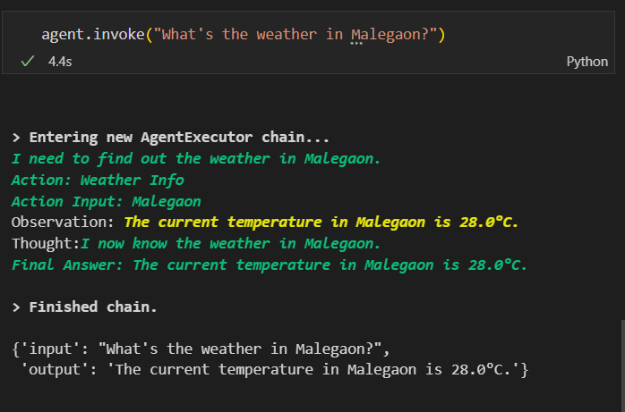
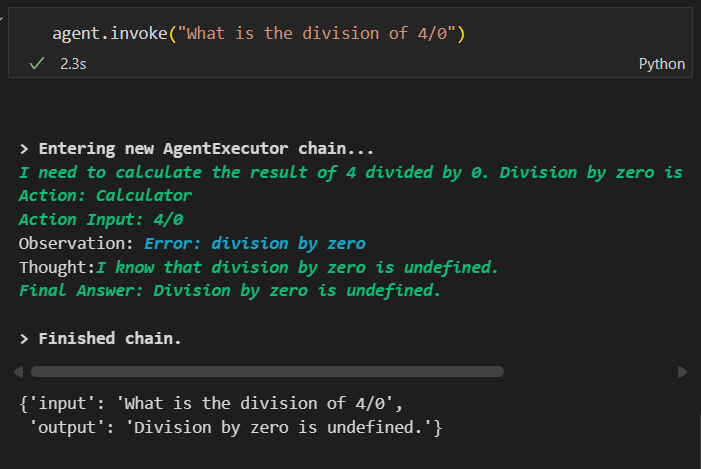

# Function Calling & Tool-Using AI Agents

**Project:** FunctionCalling_AgentApp.ipynb

This project demonstrates how **AI Agents** can dynamically interact with **external APIs and functions** to perform real-world tasks autonomously. The system uses **LangChain’s Agent framework** along with **Gemini Function Calling API** to create a collaborative multi-agent setup — one that answers general queries, and another that executes external tool calls (e.g., calculator, weather lookup, or web search).

---

## Overview

Traditional LLMs can generate text but lack the ability to perform *actions* such as fetching data or running code.
With **function calling and tool-using agents**, we enable models to reason about tasks, call functions, and use outputs as part of their reasoning pipeline — forming the foundation of **autonomous AI assistants**.

---

## Learning Objectives

| Concept                       | Description                                                              |
| ----------------------------- | ------------------------------------------------------------------------ |
| **Function Calling**          | Teach LLMs to invoke external tools or APIs based on user intent.        |
| **LangChain Agents**          | Create modular agents that can think, plan, and act.                     |
| **Toolkits & Utilities**      | Use built-in LangChain tools (Calculator, SerpAPI, etc.) or custom ones. |
| **Multi-Agent Collaboration** | Enable agents to communicate and coordinate for complex tasks.           |

---

## Project Workflow

1. **Define Tools / APIs**

   * Functions like calculator, weather API, or search API are defined as callable tools.
   * Each tool has an input schema, output schema, and purpose description.

2. **Create Agents**

   * **General Agent:** Handles open-ended or conversational queries.
   * **Tool Agent:** Handles actionable queries requiring external functions.

3. **Use LangChain’s AgentExecutor**

   * Combine both agents using `initialize_agent` and route queries intelligently.

4. **Execute Multi-Agent Interaction**

   * Example:

     * User: *“What’s the temperature in Pune and what should I wear today?”*
     * General Agent → delegates weather lookup to Tool Agent → responds with reasoning + answer.

---

## Example Use Case

| Query                                              | Agents Involved | Action                                  |
| -------------------------------------------------- | --------------- | --------------------------------------- |
| “What’s 45 * 12 + 6?”                              | Tool Agent      | Calls calculator API                    |
| “Summarize today’s weather and suggest an outfit.” | Both            | Weather → Reasoning → Combined response |
| “Search the latest AI tools launched this month.”  | Tool Agent      | Calls Google Search API                 |

---

## Example Code Snippets

### 1. Defining Tools

```python
from langchain.tools import Tool

def get_weather(city: str):
    return f"The current weather in {city} is 28°C and clear."

def calculator(expression: str):
    return eval(expression)

weather_tool = Tool(
    name="WeatherAPI",
    func=get_weather,
    description="Get the current weather for a city"
)

calc_tool = Tool(
    name="Calculator",
    func=calculator,
    description="Evaluate mathematical expressions"
)
```

### 2. Creating Agents

```python
from langchain.agents import initialize_agent
from langchain.chat_models import ChatGoogleGenerativeAI

llm = ChatGoogleGenerativeAI(model="gemini-1.5-pro")

tools = [weather_tool, calc_tool]

agent = initialize_agent(
    tools=tools,
    llm=llm,
    agent_type="zero-shot-react-description",
    verbose=True
)
```

### 3. Running the Agent

```python
response = agent.run("What’s the weather in Pune and 45 * 12?")
print(response)
```

---

## Project Output

**Notebook:** `FunctionCalling_AgentApp.ipynb`
**Outputs:**

* Function calling demo logs (tool invocation + response flow)
* Multi-agent coordination examples
* Comparison between reasoning-only and function-enabled responses

---

## Results






---

## Future Enhancements

* Integrate **CrewAI** or **LangGraph** for multi-agent orchestration.
* Add real APIs (e.g., OpenWeather, Google Search, or Currency Conversion).
* Implement **memory-enabled agents** that retain context between sessions.
* Extend to **voice-based assistant** or **Slack/Telegram integration**.

---

## References

* [LangChain Function Calling Documentation](https://python.langchain.com/docs/modules/agents/tools/function_calling/)
* [Gemini Function Calling API Guide](https://ai.google.dev/gemini-api/docs/function-calling)
* [LangChain Agents Overview](https://python.langchain.com/docs/modules/agents/)

---

* **Author:** Yash Desai
* **Email:** desaisyash1000@gmail.com 
* **GitHub:** yashdesai023
