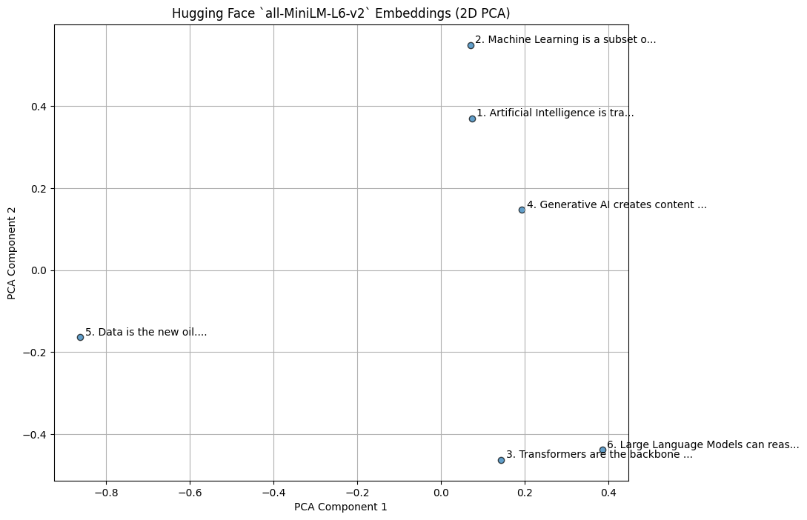
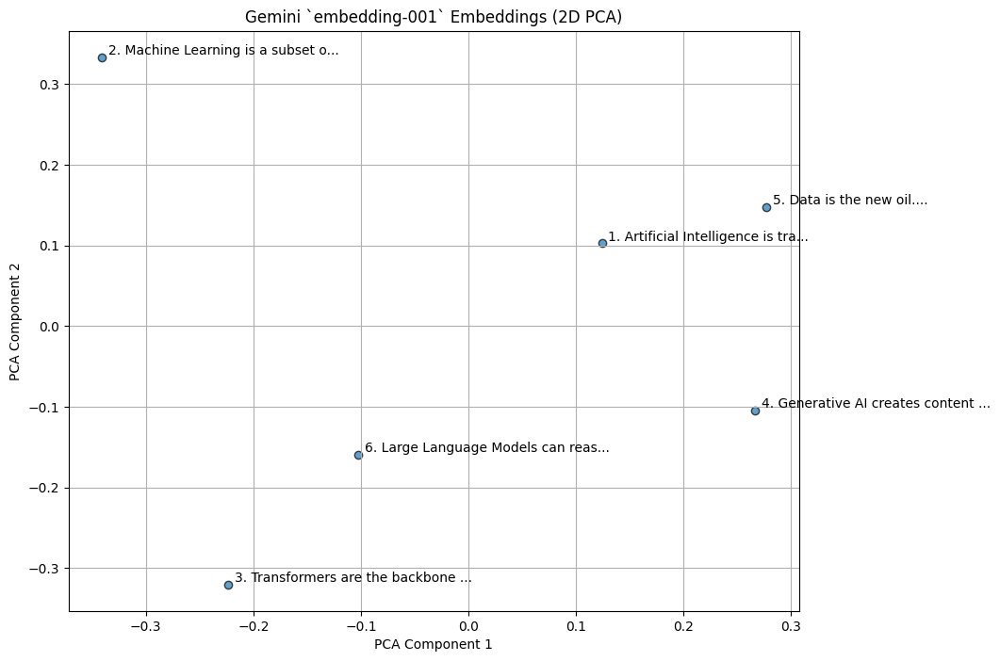

#  Transformer Tokenization & Embedding Visualizer

---

##  Project Overview

This mini-project demonstrates the **core process of modern LLMs** — converting raw text into high-dimensional **vector embeddings**.

You’ll learn practically:
- How tokenization converts words into tokens
- How Transformer models (like MiniLM) generate embeddings
- How to visualize sentence similarity using PCA
- How to compare **Hugging Face embeddings** with **Gemini’s `text-embedding-004` model**

---

##  Concept Summary

| Concept | Description |
|----------|--------------|
| **Tokenization** | Breaking text into numerical tokens that models can understand. |
| **Embeddings** | Dense vector representations capturing semantic meaning of text. |
| **Transformers** | Neural architectures that process tokens using attention mechanisms. |
| **Dimensionality Reduction (PCA)** | Reducing high-dimensional embeddings to 2D for visualization. |
| **Semantic Clustering** | Similar texts appear closer together in embedding space. |

---

##  Tech Stack & Tools

| Category | Tool / Library |
|-----------|----------------|
| **Language** | Python |
| **LLM Models** | Hugging Face (`all-MiniLM-L6-v2`), Gemini (`text-embedding-004`) |
| **Libraries** | Transformers, Torch, Scikit-learn, Matplotlib |
| **Platform** | Jupyter Notebook / Google Colab |

---

##  Dataset

You can use any small set of text samples or quotes.

Example dataset used in this project:

```python
texts = [
    "Artificial Intelligence is transforming the world.",
    "Machine Learning is a subset of Artificial Intelligence.",
    "Transformers are the backbone of modern NLP.",
    "Generative AI creates content like humans.",
    "Data is the new oil.",
    "Large Language Models can reason and write code."
]
```

📦 Optional Sources:

* [AG News Dataset (Hugging Face)](https://huggingface.co/datasets/ag_news)
* [Quotes Dataset (Kaggle)](https://www.kaggle.com/datasets/akmittal/quotes-dataset)

---

##  Implementation Steps

### **1. Setup Environment**

```bash
pip install transformers torch scikit-learn matplotlib google-generativeai
```

---

### **2. Load Hugging Face Transformer Model**

```python
from transformers import AutoTokenizer, AutoModel
import torch

model_name = "sentence-transformers/all-MiniLM-L6-v2"
tokenizer = AutoTokenizer.from_pretrained(model_name)
model = AutoModel.from_pretrained(model_name)
```

---

### **3. Generate Embeddings (Hugging Face)**

```python
def get_embeddings(text_list):
    inputs = tokenizer(text_list, padding=True, truncation=True, return_tensors="pt")
    with torch.no_grad():
        outputs = model(**inputs)
    embeddings = outputs.last_hidden_state.mean(dim=1)
    return embeddings.numpy()
```

---

### **4. Generate Embeddings (Gemini API)**

```python
import google.generativeai as genai
import numpy as np

genai.configure(api_key="YOUR_GEMINI_API_KEY")

def get_gemini_embeddings(texts):
    embeddings = []
    for t in texts:
        result = genai.embed_content(model="models/text-embedding-004", content=t)
        embeddings.append(result['embedding'])
    return np.array(embeddings)
```

---

### **5. Visualize with PCA**

```python
from sklearn.decomposition import PCA
import matplotlib.pyplot as plt

pca = PCA(n_components=2)
reduced = pca.fit_transform(hf_embeddings)

plt.figure(figsize=(8,6))
plt.scatter(reduced[:,0], reduced[:,1], c='blue')
for i, txt in enumerate(texts):
    plt.annotate(f"Text {i+1}", (reduced[i,0]+0.02, reduced[i,1]+0.02))
plt.title("Text Embeddings Visualization (Hugging Face Model)")
plt.xlabel("PCA-1")
plt.ylabel("PCA-2")
plt.show()
```

---

### **6. Compare Similarity (HF vs Gemini)**

```python
from sklearn.metrics.pairwise import cosine_similarity

hf_sim = cosine_similarity(hf_embeddings)
gemini_sim = cosine_similarity(gem_embeddings)

print("Hugging Face Similarity Matrix:\n", np.round(hf_sim, 2))
print("\nGemini Similarity Matrix:\n", np.round(gemini_sim, 2))
```

---

## 🖼️ Visualization & Results

### **1️⃣ Hugging Face Embedding Space**

> Shows how similar sentences group together in a 2D space.




```
Example: Sentences about AI and ML appear close to each other, 
while unrelated phrases (like “Data is the new oil”) appear farther apart.
```

---

### **2️⃣ Gemini Embedding Space**

> Gemini’s `text-embedding-004` produces high-quality embeddings optimized for semantic retrieval and RAG pipelines.



```
Observation: Clustering patterns are smoother and better aligned 
for semantic relationships, due to Gemini’s larger training corpus.
```

---

### **3️ Similarity Comparison**

🧮 Cosine similarity matrix comparison shows semantic consistency across both models.

🖼️ *Placeholder: `visuals/similarity_matrix.png`*

```
Example: 
Sentence 1 ↔ Sentence 2 (High similarity ~0.92)
Sentence 1 ↔ Sentence 5 (Low similarity ~0.35)
```

---

##  Output Files

| File                             | Description                                         |
| -------------------------------- | --------------------------------------------------- |
| `Transformer_Tokenization.ipynb` | Full code and visualization notebook                |
| `hf_embeddings.npy`              | Saved Hugging Face embeddings                       |
| `gemini_embeddings.npy`          | Saved Gemini embeddings                             |
| `visuals/`                       | Folder containing PCA plots and similarity heatmaps |

---

##  Summary

✅ **Learnings:**

* Understood tokenization and embedding generation flow.
* Visualized semantic similarity between sentences.
* Compared Hugging Face vs Gemini embeddings for clarity and clustering quality.
* Built the foundation for **RAG systems** and **vector databases** in upcoming days.

🧠 **Next Step →** Move to **LangChain & Vector Databases**
You’ll use these embeddings for document retrieval and chatbot construction.

---

##  Future Enhancements

* Add **t-SNE** visualization for better clustering visualization.
* Create an **interactive Streamlit app** to upload your own text and visualize embeddings live.
* Compare embeddings across multiple models (e.g., `bge-small`, `mxbai`, `e5-large`).

---

* **Author:** Yash Desai
* **Email:** desaisyash1000@gmail.com 
* **GitHub:** yashdesai023
